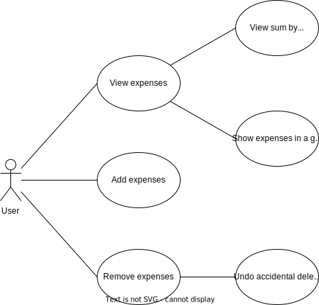
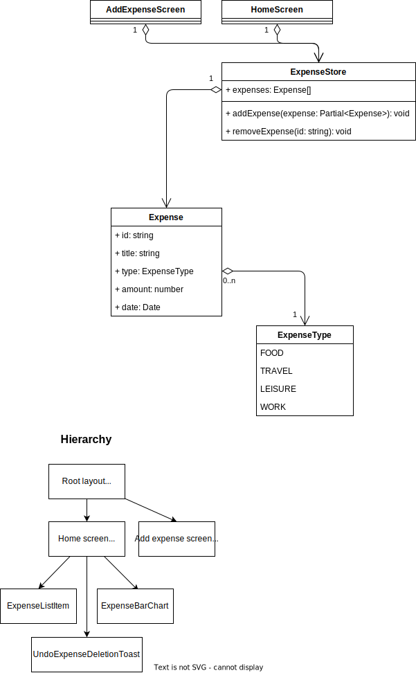
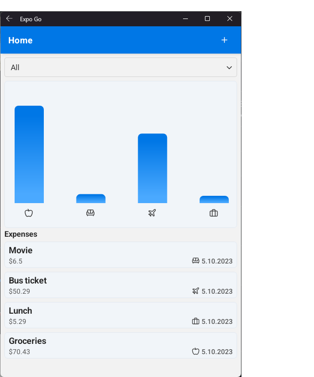
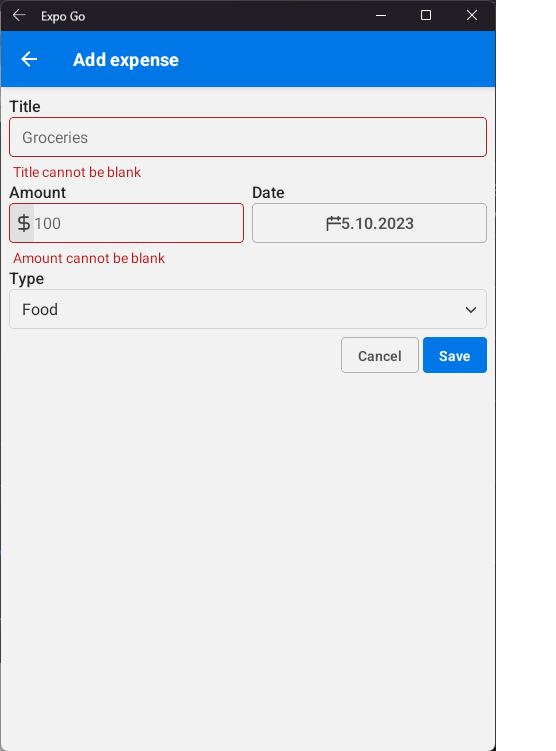

# Assignment 1: Expense tracker app

## Use cases

- As a User I want to list my expenses
- As a User I want to list my expenses in a given time period
- As a User I want to view a sum of my expenses by type
- As a User I want to add an expense
- As a User I want to remove an expense
- As a User I want to undo accidental removal of expenses

## Class diagram & layout/component hierarchy diagram

## Project structure

This project utilizes Expo Router, which is a file-based router. The routes are defined as files in the [`src/app`](src/app) directory.

The app consists of two screens:

- [Home/overview screen (start)](src/app/index.tsx)
- [Add expense screen](src/app/add.tsx)

These two screens are rendered within the Stack as defined in the [layout file](src/app/_layout.tsx).

Any shared functionality or abstracted components are moved into the `src/components` directory and other directories outside the `app` directory.

The add and view screen need to interact with a shared piece of state, for this I use [zustand](https://docs.pmnd.rs/zustand/getting-started/introduction) as opposed to React Context.

## Additional features

- Persistent storage of expenses (zustand middleware using AsyncStorage)
- Period views (this week, this month, this year, total)

## Results

Home screen:  

Add screen:  

