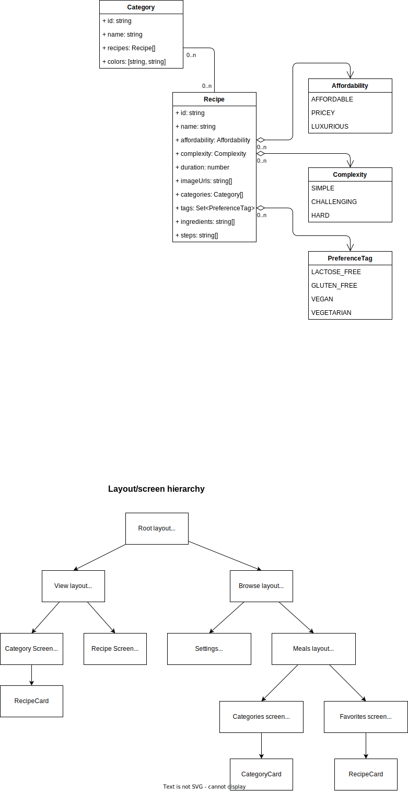

# Assignment 2: Meals app

## Use cases

## Class diagram & layout/component hierarchy diagram

## Project structure

This project utilizes Expo Router, which is a file-based router. The routes are defined as files in the [`src/app`](src/app) directory.

The app consists of five screens:

- [Home/categories screen (start)](<src/app/(browse)/(meals)/index.tsx>)
- [Favorites screen](<src/app/(browse)/(meals)/favorites.tsx>)
- [Settings screen](<src/app/(browse)/settings.tsx>)
- [Category screen](<src/app/(view)/categories/[id].tsx>)
- [Recipe screen](<src/app/(view)/recipes/[id].tsx>)

These screens are rendered within different layouts, a description can be found in the hierarchy portion of the [diagram above](#class-diagram--layoutcomponent-hierarchy-diagram).

Any shared functionality or abstracted components are moved into the `src/components` directory and other directories outside the `app` directory.

## Additional features

- Image carousel to supporting multiple meal images
- Warning for meals with "incompatible" preferences (edge-case if they mark it as favorite prior to setting their preferences)

## Results

